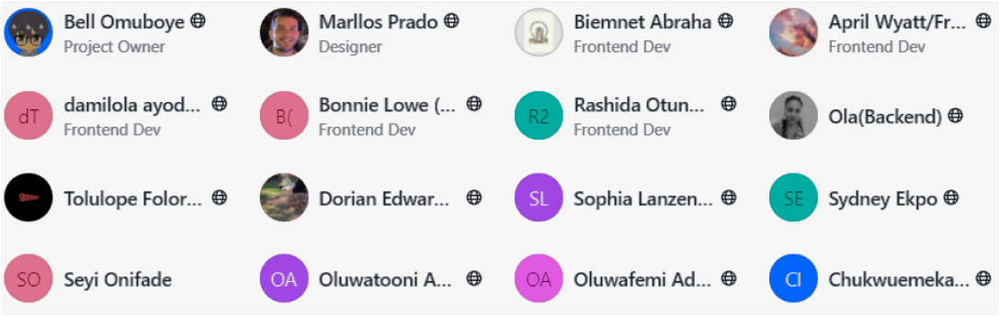

# 📱 → 🎓 | Self-Learning-App 

 

                                                             
  

  
 

<section>

 

**Figma Project**: [https://www.figma.com/file/JoFlxJ04i4SFyT0WPBiLqB/LetMhelp!?node-id=100%3A2114](https://www.figma.com/file/JoFlxJ04i4SFyT0WPBiLqB/LetMhelp!?node-id=100%3A2114)

**Presentation**: [https://youtu.be/xAIIlrIr9sY?t=1960](https://youtu.be/xAIIlrIr9sY?t=1960)

This project was designed under the Reskill Americans Program as a team project carried by me and my teammates. The problem statement for our team established that we had to design and implement an App to support self-learning students to find and connect to voluntary tutors in the tech field. Most of the high-level requirements were pre-defined by the program. I was the UX designer of my team and my responsibilities involved going through the Defining, Ideating, Prototyping stages. Here you can access the low-fidelity and high-fidelity prototypes of the App that resulted from this project. I was also responsible for defining and designing the name and logo of the App "LetMHelp!" .

  
In this repo, you can find the description of the problem ([Project Brief](https://github.com/pradoprojects/Self-Learning-App/blob/main/Project%20Brief%20-%20Asana.pdf)) containing some high-level requirements, as well as the SVG files of the logo. You can also find the link to the Figma Project and my presentation above.

  

 

  
<h2>
Thank you to all the amazing teammates involved in this project with me!
</h2>

  

</section>

